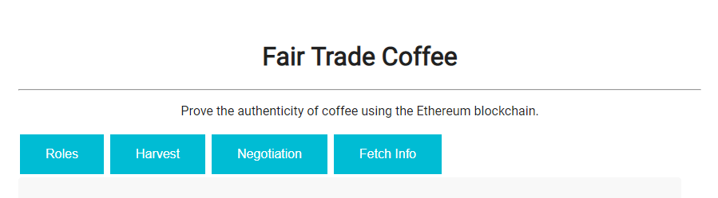
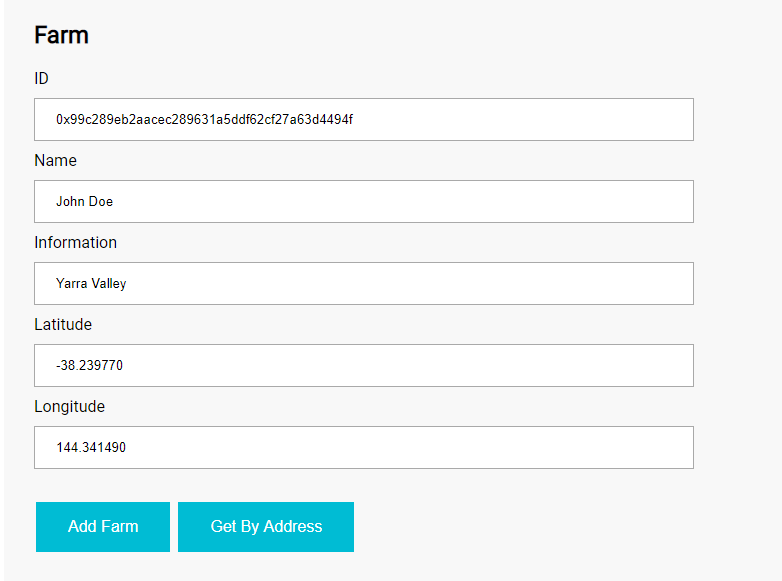
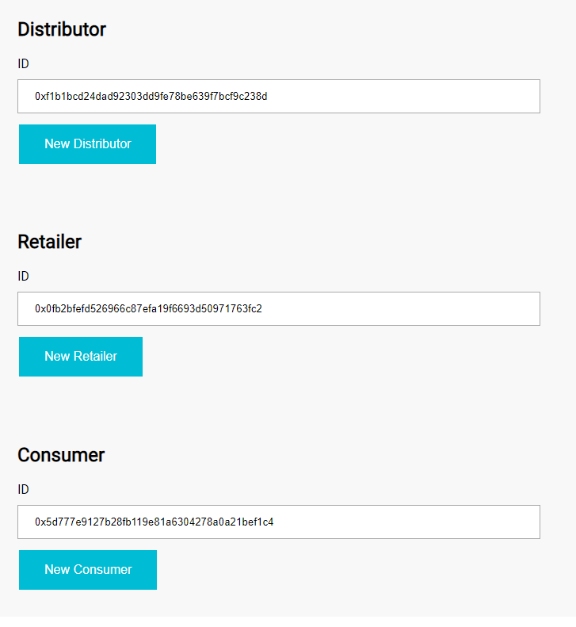
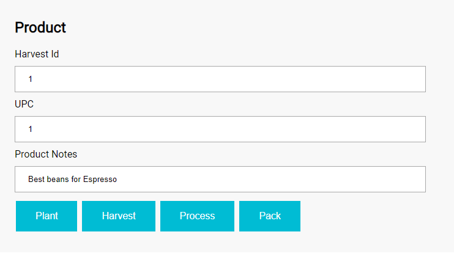
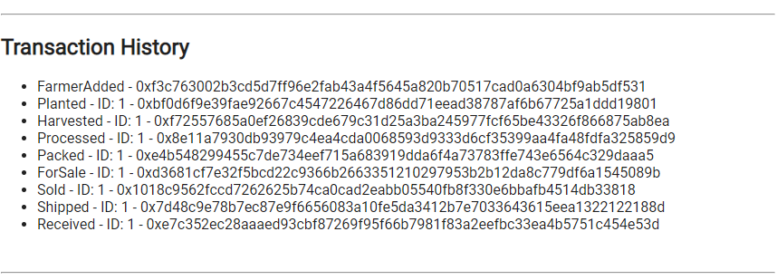
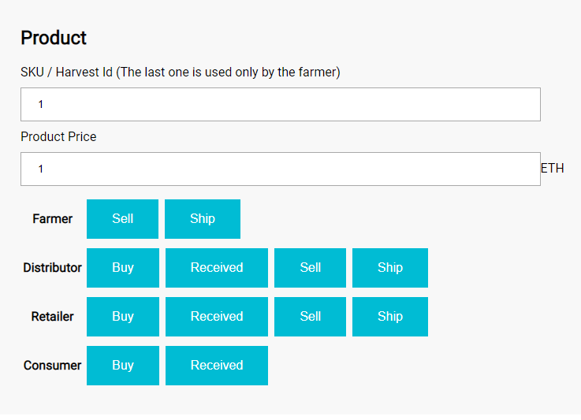
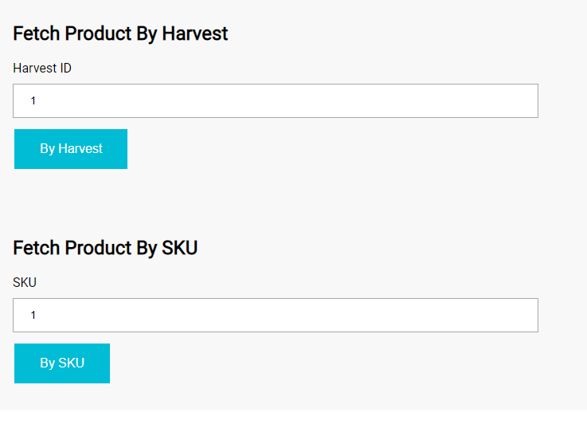

# Coffee Suply Chain

## Getting Started

The proposal of this document is to guide you over this project.

### Technical References

*  [OpenZeppelin](https://www.npmjs.com/package/openzeppelin-solidity): v2.3.0 - A library for secure smart contract development
*  [LiteServer](https://www.npmjs.com/package/lite-server): v2.4.0 - _Development only_ node server that serves a web app
*  [Truffle](https://www.npmjs.com/package/truffle): v5.0.22 - Development environment, testing framework and asset pipeline for Ethereum
*  [Ganacha CLI](https://www.npmjs.com/package/ganache-cli): v6.4.4 - Uses ethereumjs to simulate full client behavior and make developing Ethereum applications faster, easier, and safer
*  [Metamask](https://metamask.io/): v6.7.2 - It allows you to run Ethereum dApps right in your browser without running a full Ethereum node
*  [Solidity](https://solidity.readthedocs.io): >=0.4.24 - Ethereum language for writing Smart Contracts
*  [Node](https://nodejs.org): v12.6.0 - JavaScript runtime
*  [Web3.js](https://web3js.readthedocs.io): v1.0.0-beta.37 - A collection of libraries which allow you to interact with a local or remote Ethereum node, using an HTTP, WebSocket or IPC connection

### Folder Structure

```
..
├── ...
├── project-6
| ├── contracts
| | |── access-control # The RBAC is implemented here
| | |── coffeebase # Where the contract code for our SupplyChain is located
| | └── ...
| ├── ...
| ├── src
| | |── js
| | | |── app.js # Where the front-end calls the Contract methods
| | | └── truffle-contract.js
| |── test
| | └── TestSupplychain.js # Where the truffle tests are implemented
| |── bs-config.json # Configuration for Lite-Server
| |── index.html # The main page, where the front-end is located
| |── ...
| |── truffle-config.js # Configuration for truffle commands, the address of ganache server goes here
| |── ...
|── ...
|── 0_ganache-cli.txt # Address created when running commented bellow
|── 1_start_ganache-cli.sh # Command to start Ganache with a predefined Wallet
└── ...
```

### Running Solution

You will nedd three terminals:

- Terminal 1:
-  `npm run dev`: to start the litea-server
- Terminal 2:
-  `ganache-cli -m "spirit supply whale amount human item harsh scare congress discover talent hamster"`: To start Ganache with specific Wallets
- Terminal 3
-  `truffle compile`: To compile the contracts
-  `truffle migrate`: To apply the contrats to the network

### Running Tests

You will need two terminals:

- Terminal 1: Run the ganache-cli command showed above
- Terminal 2:
-  `truffle test`: To execute the tests

## Screens

### Menu

-  Roles: Where you can register new Farms, Distributors, Retailers and Costumers
-  Harverst: Where you can control the production, made only for the Farmer
-  Negotiation: Wher all the transactions are made, puting for Sale, Buying, Shipping and Receiving
-  Fetch Item: Get product's informations from the database



### Roles

This part of the screen is made for register new Companies. The *Get By Address* only made a *console.log* information, so you need to look your console to see it.



In this screen you can add new Distributors, Retailers and Consumers too, just put the wallet you want, as shown bellow:



### Harvest

Where the farmer can plant new Products and goes until the Packing phase.

 

-  Plant: Register that a item has been planted
-  Harverst: To harvest the plantation
-  Process: Process the harvest for been packed
-  Pack: Prepare the item for been sold

**OBS**: The IDs for *SKU* and *Harvest ID*(this is used only by the farmer) is register on the Transaction  part of the screen, as shown bellow, the **ID**, can be the SKU or the Harvest ID, depending on the phase.

 

### Negotiation

Used for Selling, Buying, Sending and Receiving methods, dispared by ones involved in the process.

 

**OBS**: Each Role has an specific line with your actions, the screen is using the contract owner always, and this one has all the Roles, so you can navigate for all the process. But if you try to jumb states you will have an error, like receiving something you do not buy, or buying from the costumer something that is for sale by the farmer.  So the selling and buying must follow: from Farmer to Distributor, from Distributor to Retailer, from Retailer to Costumer, and the Costumer can sell nothing.

### Fetch Information

The last screen is used to retrive information of the plantation or the products for sale.

 

**OBS**: The information will be printed on the console.

## Diagrams

### Activity


### Sequence


### State


### Classes


